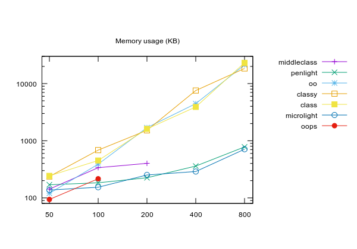
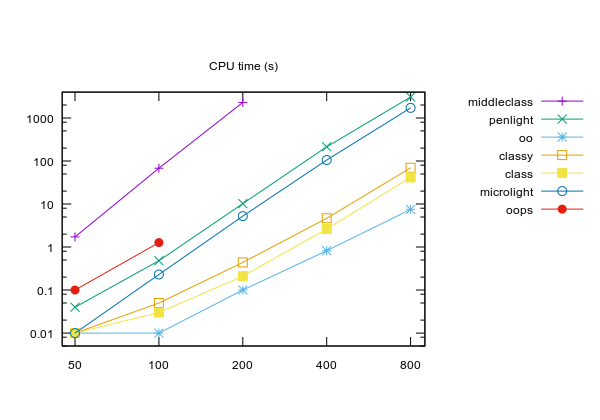

Pure Lua OOP with multiple inheritance
======================================

Use `T = Base:extend(Mixin1, Mixin2, ...)` to create subclasses,
`T()` or `T{attribute1=1, attribute2=2, ...}` to create instances,
and `object:is(MyClass)` to test instance typing. Mixins can be
other classes or plain Lua tables, their attributes are shallowly
copied to the new class. Initializers are optional and defined by
an `__init` function, and you can access the superclass of an 
instance with `object.super`. If the initializer is called with a
single table as the first parameter, the table contents are used
to initialize the object, otherwise all parameters are passed to
`T.__init`.

Note that you can change attributes and methods after subclassing,
and it is possible inherit from instances (prototypes a la JS).
Also, `object.super` is there for convenience only and can be 
overwritten if used for something else.

Example usage:

```lua
	class = require 'oo'

	Product = class()
	Product.name = 'Generic Product'
	function Product:print()
		print(self.name)
	end

	Automobile = Product:extend {
		fueled = true,
		wheels = 4,
		__init = function(self)
			self.name = 'Automobile: '..self.name
		end
	}
	a = Automobile()
	a:print()  -- Automobile: Generic Product

	Bicycle = Product:extend()
	Bicycle.wheels = 2
	function Bicycle:__init()
		self.name = 'Bicycle: '..self.name
	end
	function Bicycle:print()
		self.super.print(self)
		print('Wheels: ', self.wheels)
	end
	b = Bicycle{ name='Houston MTB' }
	b:print()  -- Bicycle: Houston MTB\nWheels: 2

	Motorcycle = Automobile:extend(Bicycle)
	c = Motorcycle{ name='Honda CG 200' }
	c:print()  -- Automobile: Honda CG 200\nWheels: 2
	= c.fueled -- true

	= a:is(Product)     -- true
	= a:is(Automobile)  -- true
	= a:is(Bicycle)     -- false
	= a:is(Motorcycle)  -- false

	= b:is(Product)     -- true
	= b:is(Automobile)  -- false
	= b:is(Bicycle)     -- true
	= b:is(Motorcycle)  -- false

	= c:is(Product)     -- true
	= c:is(Automobile)  -- true
	= c:is(Bicycle)     -- true
	= c:is(Motorcycle)  -- true
```

There are other interesting alternatives in luarocks, so I have
*benchmarked them all*. This test does NOT represent a
real-world class hierarchy, but helps to compare some of the
library overhead and therefore helped me to improve `lua-oo`.
Anyway, the test is something like:

```lua
local class = require 'oo'
local n = 0
local N = 100

--create a base class
local c = { class() }

--create a deep chain of subclasses
for i=2,N do
	c[i] = c[i-1]:extend()
end

--create many random objects and count instances of all classes
for i=1,N*N do
	local obj = c[math.random(N)]()
	for j=1,N do
		if obj:is(c[j]) then
			n = n + 1
		end
	end
end

print(n, collectgarbage('count'))
```

The results (ran on a Core2 P8600, with luajit-2.1.0-beta2):

Memory usage, as reported by `collectgarbage('count')`:



CPU user time, as reported by `time -p ...`.  
Note: I ignored system time to see what is running in Lua side
without allocation, I/O and context switches.



`Oops` crashed for N >= 200, and `middleclass` took more than 1h for
N >= 400, so they were out of these instances.

Analyzing these results, we see three classes:

1. `middleclass` and `oops` using less memory but more cpu;
2. `class`, `classy` and `oo` using less cpu but more memory;
3. `microlight` and `penlight` in between, balancing cpu and memory usage.

That said, for now I personally prefer `microlight` or `penlight`
for memory-constrained targets (e.g. Raspberry Pi) and `class`,
`classy` or `oo` for desktop targets or server back-ends.

# See also

I received feedback from a stronger typing module, you should [check it](//github.com/winterwolf/typedobject) too.

---

MIT/X license (c) 2016-2020 Daniel Lima
